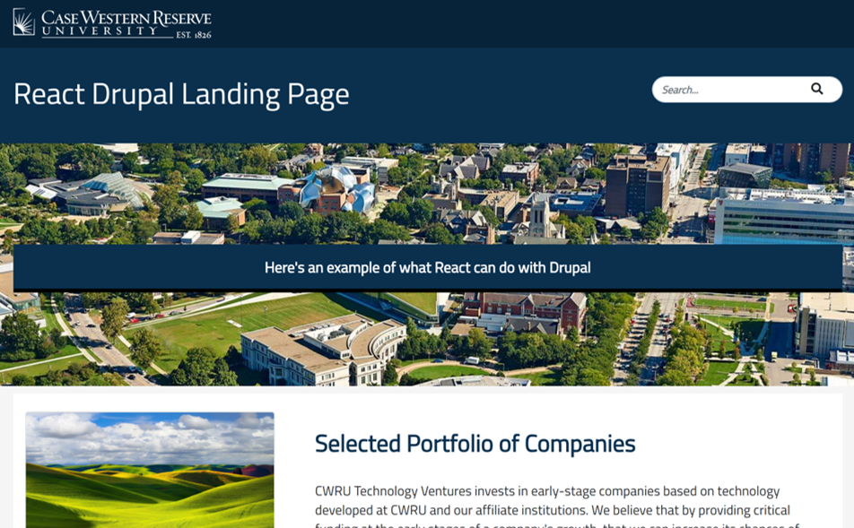

# Decoupled Drupal with React

Rahul Raj, Junaid Irshad, David Ferro, Brett Bender

Project Manager: Tom Seeber

https://davidferro91.github.io/DrupalReactProject/

## Description

Case Western Reserve University’s website is built using Drupal, a content management system that employs the LAMP stack (Linux, Apache, MySQL, and PHP).  Part of Drupal’s features is the inclusion of themes and views for the client.  However, for our project, we have decoupled this front end, turning the Drupal site into a RESTful API from which a new front end built with React can access and render the data. This provides all of the benefits and speed of a single-page site with multiple routes for rendering the different content.  This also allows for the creation of new landing pages for marketing and advertising purposes almost instantaneous from using the React components and layouts we have created under the development guidelines.   Due to the sensitive nature of the data and the back end code, this is not a fully-deployed project, but rather a proof of concept.

### Technologies Used
<ul>
    <li>Drupal</li>
    <li>React.js</li>
    <li>JavaScript</li>
    <li>HTML5</li>
    <li>CSS</li>
    <li>BootStrap</li>
</ul>
